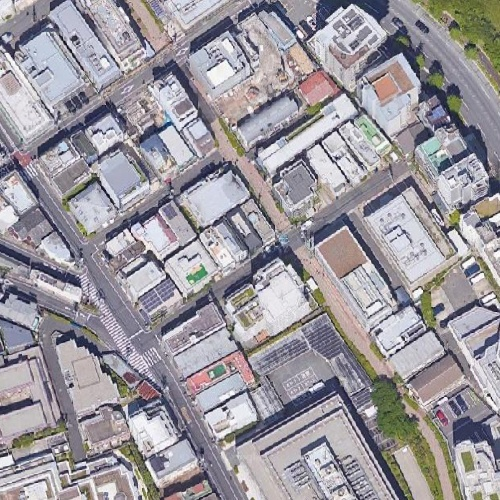
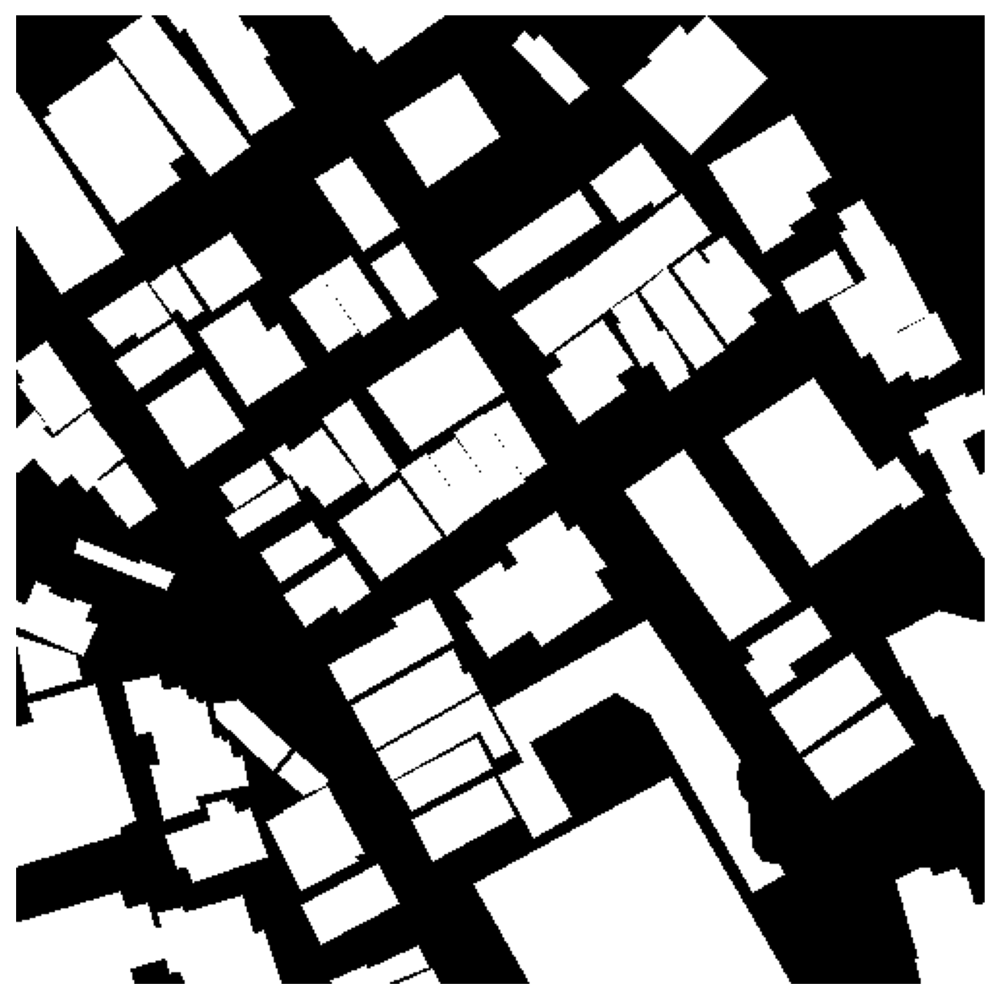

# Building Extraction from Satellite Images - U-Net (ResNet34) - val IoU ≈ 0.78

This repository implements a semantic segmentation pipeline to detect buildings from satellite imagery. The goal is to balance computational efficiency and model performance using a U-Net-based architecture.

## Repository Structure

```
building-extraction/
│
├── README.md                   # Project overview and instructions
├── requirements.txt            # Python dependencies
│
├── data/
│   ├── instructions.txt        # How to obtain the dataset
│
├── src/                        # Source code
│   ├── prepare_dataset.py      # Preprocess raw images/masks
│   ├── dataset.py              # Dataset class converting images/masks to tensors
│   ├── trainv1.py              # Initial U-Net training script
│   ├── train_final_version.py  # Final training script
│   └── test.py                 # Inference and submission generation
│
├── checkpoints/                # Saved model weights
│   └── unet_final.pth
│
└── outputs/                    
    └── submission.csv          # Kaggle submission file
```

---

## Installation

This project is designed to be run on **Google Colab**, which provides free GPU acceleration for faster training and inference.

1. Open a new Colab notebook.
2. Clone the repository:
```bash
!git clone https://github.com/your-username/building-extraction.git
%cd building-extraction
```
3. Install dependencies:

```bash
pip install -r requirements.txt
```

---

## Data Preparation

1. Read `data/instructions.txt` for detailed steps on how to download and structure the dataset.
2. Preprocess the data with:

```bash
python src/prepare_dataset.py
```

This generates masks in `data/processed/` for training and validation.

---
### Example mask conversion

| Original | Mask |
|---------|-----------|
|  |  |

## Model

* **Architecture**: U-Net with ResNet-34 encoder and 4 decoder blocks.
* **Training Scripts**:

  * `trainv1.py`: Initial simpler U-Net (lower performance).
  * `train_final_version.py`: Final model with better accuracy and mixed precision for efficiency.
* **Optimizer**: AdamW
* **Loss Function**: Weighted combination of BCE loss and F1-score (emphasis on F1).
* **Metrics**: IoU, F1-score, BCE, precision, recall

The final model achieved an IoU of ~0.78 on the validation set.

---

## Inference

Run predictions on new images using:

```bash
python src/test.py
```

* Predicted masks are saved in `test_prediction_masks/`.
* A Kaggle submission CSV is generated as `outputs/submission.csv`.
* Small speckles in masks are automatically removed during post-processing.

---

## Results & Notes

* The final model outperforms the initial version, mainly due to higher complexity and F1-score focus.
* Longer training or additional epochs may improve results further.
* Kaggle submission score: ~0.26. The discrepancy may relate to the mask-to-polygon conversion in `test.py`.

---

## Requirements

See `requirements.txt` for all necessary Python packages.

---

## License

Specify your license here (e.g., MIT License).
